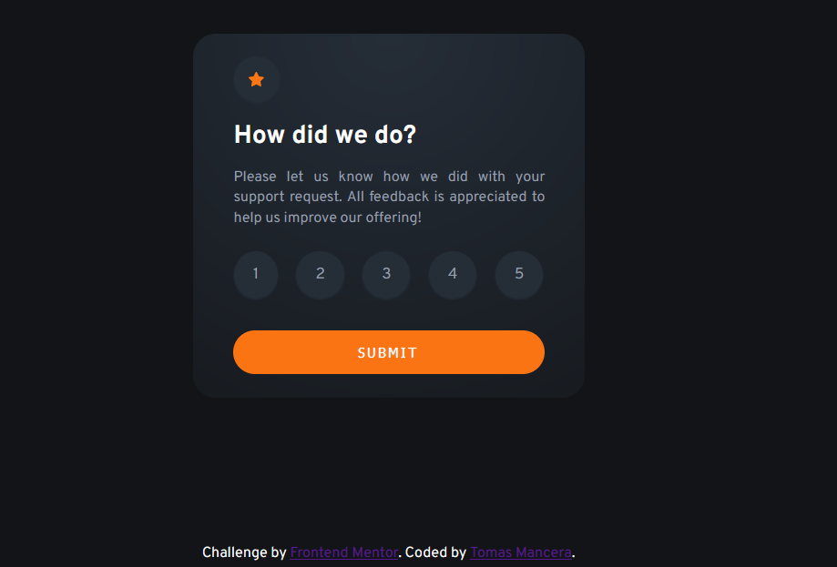

# Frontend Mentor - Interactive rating component solution

This is a solution to the [Interactive rating component challenge on Frontend Mentor](https://www.frontendmentor.io/challenges/interactive-rating-component-koxpeBUmI). Frontend Mentor challenges help you improve your coding skills by building realistic projects. 

## Overview

### The challenge

Users should be able to:

- View the optimal layout for the app depending on their device's screen size
- See hover states for all interactive elements on the page
- Select and submit a number rating
- See the "Thank you" card state after submitting a rating

### Screenshot

### Links

- Solution URL: [ Solution URL ](https://github.com/TomasMancera/Interactive-rating-app)
- Live Site URL: [ live site URL ](https://tomasmancera.github.io/Interactive-rating-app/)

### Built with

- Semantic HTML5 markup
- CSS custom properties
- Flexbox
- CSS Grid
- Mobile-first workflow

### What I learned

I learned how to use Javascript in this kind of interactive components and how I can organize it in a better way in regards to make it funcional, I also learned how I can make the shadow shape at the top of the card with css which is an interesting tool to implement in other projects.
